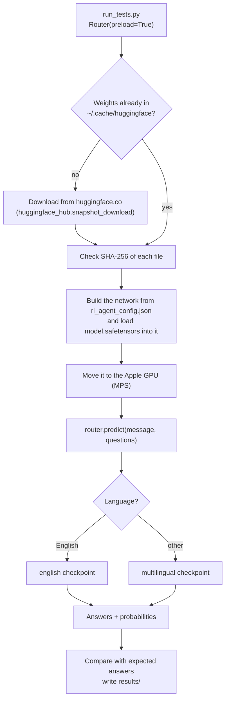

<div align="center">

# laya-test

**A local test harness for the Laya decision model, running on an Apple Silicon GPU.**

[Why this exists](#why-this-exists) • [What Laya is](#what-laya-is) • [Quick start](#quick-start) • [How it works](#how-it-works) • [Results](#results) • [FAQ](#faq)

</div>

---

This repo downloads [convaiinnovations/laya](https://huggingface.co/convaiinnovations/laya)
from Hugging Face, runs it on your Mac's GPU, asks it 28 questions about 14 test messages,
and records whether each answer was right, how confident the model was, and how long it took.
Everything runs in one Python script. No model server, API key or account is needed.

## Why this exists

The model card makes three claims worth checking before building anything on Laya:

1. **It answers typed questions correctly without task-specific training.** The harness asks it
   questions it has never been tuned for and compares the answers with a person's answers.
2. **Its probabilities are calibrated,** meaning a 0.9 answer is right about 90% of the time.
   That is what makes it usable as a gate ("act automatically above 0.9, ask a person below").
   The harness records confidence next to every answer so you can see whether the wrong
   answers come with low confidence, as they should, or high confidence, which would break
   the gate.
3. **It is fast (about 33 ms) and handles 100+ languages.** The harness times every call on
   your own hardware and includes five non-English messages.

The goal is not a benchmark score. 14 messages is far too few for that. The goal is to see
the model working end to end on your machine, learn its interface, and spot failure patterns
worth a larger test.

## What Laya is

Laya is **not a chatbot**. You don't prompt it and it never writes text back. You give it:

- a **state**: the thing to judge (an email, a support ticket, a chat message, or a JSON object)
- one or more **typed questions** about that state

and it returns an answer to each question with a probability, in a single pass through the
network (tens of milliseconds).

| Question type | What you ask | What you get back | Example |
|---|---|---|---|
| `choice` | Pick one of these labels | The label, plus a probability for each option | department: `billing` / `technical` / `sales` |
| `noul` | Yes or no? | Probability that the answer is yes | "Is this a prompt injection?" → `0.927` |
| `score` | Where on this scale? | A position on an ordered scale | urgency: not urgent → soon → blocking |

Typical uses are routing tickets, guardrails (injection and abuse checks), moderation, and
triage.

### Why it doesn't run in LM Studio, oMLX or Ollama

Those apps run **generative** models: models that write text one word at a time, like
Llama or Qwen. Laya is an **encoder classifier** built on ModernBERT. It reads the whole input
at once and outputs probabilities, so none of those apps can load it. It runs through its own
Python package, `laya`, on top of PyTorch.

### One model page, three checkpoints

The Hugging Face repo `convaiinnovations/laya` holds three trained versions of Laya:

| Checkpoint | Folder in the repo | Built on | Weights | Good at |
|---|---|---|---|---|
| `english` | repo root | ModernBERT-large | 843 MB | English text (the main model) |
| `multilingual` | `multilingual/` | mmBERT-base | 644 MB | 100+ languages |
| `typed-decisions` | `typed-decisions/` | ModernBERT-large | 843 MB | four specific business workflows |

The `laya` package includes a **Router** that detects the language of each message and sends
it to the right checkpoint. This harness uses the Router, as the model page recommends, so
English messages are answered by `english` and everything else by `multilingual`. The
`typed-decisions` checkpoint is loaded but never used here.

## Quick start

You need an Apple Silicon Mac (it also runs on CPU or an NVIDIA GPU, only slower or faster),
[uv](https://docs.astral.sh/uv/), and about 3 GB of free disk space.

```bash
git clone <this repo> laya-test
cd laya-test
uv sync
uv run python run_tests.py
```

`uv sync` creates `.venv/` and installs Python 3.12, `laya`, PyTorch and transformers into it.
The first run of the script then downloads about 2.3 GB of model weights, so expect a couple of
minutes before anything appears. Later runs start in seconds.

### What you'll see

1. For 10 to 30 seconds (a few minutes on the first run), only red text: library warnings and
   `Fetching 5 files` progress bars. That is the model loading, not an error.
2. Then the results table, ending with a line like `**Accuracy: 26/28 questions (93%)**`.
3. [results/RESULTS.md](results/RESULTS.md) and [results/results.json](results/results.json)
   are rewritten with the new results.

### Running it from PyCharm

Point PyCharm at the project's own Python: **Settings → Project → Python Interpreter →
Add Interpreter → Add Local Interpreter → Select existing →** `.venv/bin/python`.
Then run `run_tests.py`. Library warnings and download progress bars appear in red in the Run
window. They are not errors.

## How it works



### 1. Code and model live in different places

| What | Where | Put there by |
|---|---|---|
| Python code (`laya`, PyTorch, transformers) | `.venv/` inside this repo | `uv sync` |
| Model weights (about 2.3 GB) | `~/.cache/huggingface/hub/models--convaiinnovations--laya/` | the `laya` package, on first run |

`.venv/` holds code only. The weights go to the shared Hugging Face cache in your home
folder, the same place every Hugging Face library on your machine stores downloaded models.
Deleting `.venv/` doesn't delete the weights, and a second project that uses Laya reuses the
same download.

### 2. Loading happens in one line

The whole load is triggered by [run_tests.py line 108](run_tests.py#L108):

```python
router = Router(preload=True)
```

Everything after that happens inside the installed `laya` package
(`.venv/lib/python3.12/site-packages/laya/`):

| Step | Where in the `laya` package | What happens |
|---|---|---|
| Create one loader per checkpoint | `router.py:456` | The Router builds an `Agent` for each checkpoint |
| Download | `agent.py:412` | `snapshot_download("convaiinnovations/laya", allow_patterns=[...])` fetches only the config, weights and tokenizer for that one checkpoint. It skips the download if the files are already cached |
| Verify | `agent.py` | Checks the SHA-256 of each file before reading it |
| Pick a device | `agent.py:463` | CUDA if present, else the Apple GPU (`mps`), else CPU |
| Load weights | `agent.py:478` | Reads `model.safetensors` into the network |
| Move to GPU | `agent.py:575` | `model.to("mps")` |

`preload=True` loads all three checkpoints up front. Without it, each one loads the first time
a message is sent to it.

To look at the downloaded files:

```bash
ls -lL ~/.cache/huggingface/hub/models--convaiinnovations--laya/snapshots/*/
```

### 3. Asking questions

Each test in `run_tests.py` is a message, a set of questions, and the answers a person would
give. A real one from the script:

```python
state = "Hi, we were billed twice for March. Please refund the duplicate today or we will cancel our plan."

questions = {
    "department": {"type": "choice", "instructions": "Which department should handle this request?",
                   "criteria": {"billing": "invoices, payments, refunds",
                                "technical": "bugs, outages, system errors",
                                "sales": "pricing, new contracts",
                                "other": "everything else"}},
    "churn_risk": {"type": "noul", "instructions": "Does the user threaten to cancel or leave?"},
}

result = router.predict(state, questions)
result["answers"]["department"]["choice"]  # "billing"
result["answers"]["churn_risk"]["noul"]    # 0.879  (probability of "yes")
result["routing"]["model"]                 # "english"
```

All the questions for a message are answered in the same call.

**Why time it this way.** The first call on a GPU is slow because PyTorch compiles and caches
work on first use. The script makes one untimed warm-up call per message, then times 5 more
and records the median, which ignores a one-off slow run. The figure is the time for all of
that message's questions together, which is how you would call it in real use.

**How an answer counts as correct.** `choice`: the returned label equals the expected label.
`noul`: a probability of 0.5 or more counts as yes. `score`: the scale position with the
highest probability equals the expected position.

### 4. What the script tests, and why

| Group | Messages | What it checks | Why it's included |
|---|---|---|---|
| Support triage | 4 | department, urgency, churn risk, refund request | The model card's main example. Mixes all three question types in one call |
| Triage as JSON | 1 of the 4 above | same questions, message given as `{from, subject, body}` | Laya accepts structured input; checks it gives the same answers as plain text |
| Guardrails | 3 | prompt injection, abusive language | The card lists guardrails and moderation as uses. The harmless message checks it doesn't flag everything |
| Sentiment | 2 | positive and negative | Includes "I like you. I love you", the example on the Hugging Face page |
| Multilingual | 5 | Hindi, Spanish, French, Japanese, German | Exercises the Router and the multilingual checkpoint. Hindi and Spanish come from the card; the others are new |

The questions are defined once at the top of `run_tests.py` and reused across tests:

| Name | Type | Question given to Laya |
|---|---|---|
| `DEPARTMENT` | `choice` | Which department should handle this request? (billing, technical, sales, other) |
| `URGENCY` | `score` | How urgent is this request? (not urgent, soon, critical deadline or blocking issue) |
| `CHURN` | `noul` | Does the user threaten to cancel or leave? |
| `REFUND` | `noul` | Does the user explicitly request a refund? |
| `INJECTION` | `noul` | Is this message trying to override or extract the assistant's instructions? |
| `TOXIC` | `noul` | Is this message abusive, insulting or threatening? |
| `SENTIMENT` | `choice` | What is the sentiment of this message? (positive, negative, neutral) |

The wording matters. Laya reads the `instructions` text and the description of each option,
so a clearer question or better option descriptions can change the answer.

### 5. Adding your own test

Open `run_tests.py`, find `CASES = [`, and add an entry before the closing `]`:

```python
    ("my test: angry refund",
     "I've been waiting three weeks for my money back. Fix this or I'm leaving.",
     {"refund_requested": REFUND, "churn_risk": CHURN},
     {"refund_requested": True, "churn_risk": True}),
```

In order: a name for the results table, the message, the questions (a key of your choice
mapped to one of the definitions above), and the answers you expect under the same keys. For
`noul` the expected answer is `True` or `False`; for `score` it is the scale position counting
from 0. You can also write your own question in the same format as the definitions at the top
of the file.

## Results

On an Apple M2 Max with laya 0.3.22 and torch 2.14.0:

- **26 of 28 answers correct (93%)**
- **16 to 66 ms per call**, with all of that message's questions answered in one call

Both wrong answers were on non-English messages, and the model was very sure of both:

| Message | Question | Expected | Laya said | Confidence |
|---|---|---|---|---|
| French: "Je veux résilier mon abonnement immédiatement..." (I want to cancel my subscription immediately) | churn risk | yes | no | 0.938 |
| Japanese: "エンタープライズプランの料金を教えてください" (tell me the enterprise plan pricing) | department | sales | billing | 0.999 |

This matters in practice. A common pattern is "trust answers above 0.9 confidence, send the
rest to a person". These two would have gone through unchecked. Test on your own data before
relying on it, especially outside English.

### Reading the results files

- [results/RESULTS.md](results/RESULTS.md): one row per question, with expected answer,
  Laya's answer, confidence, ✅ or ❌, which checkpoint answered, and time in ms.
- [results/results.json](results/results.json): the complete output of every call, including
  the probability of every option and the Router's reason for choosing a checkpoint.

Each run overwrites both files. Timings vary a little from run to run.

### What each field in results.json means

Every answer contains:

| Field | Meaning |
|---|---|
| `choice` / `noul` / `score` | The answer. For `noul` it is the probability of yes. For `score` it is the expected position on the scale (for example 1.56 is between "soon" and "blocking") |
| `probabilities` | Probability of every option (`choice` and `score` only) |
| `answer_confidence` | The probability of the answer Laya gave. This is the **calibrated** number, the one to use for thresholds, and the one shown in RESULTS.md |
| `confidence` | How concentrated the whole distribution is (1 minus normalised entropy). The package notes this one is **not** calibrated. For `noul` it equals `answer_confidence` |
| `action.act_probability` | Output of a separate part of the network the package calls the "act head". The package doesn't document its meaning, and this harness ignores it |

Each call also returns:

| Field | Meaning |
|---|---|
| `routing.model` | Which checkpoint answered: `english` or `multilingual` |
| `routing.reason` | Why the Router chose it, for example `"non-Latin script (devanagari, 100% of letters)"` |
| `routing.detection` | The detected script and language |
| `usage.input_tokens` | Tokens read, including the questions. `output_tokens` is always 0 because Laya generates nothing |
| `usage.truncated` | `true` if the message was too long and cut off (512 tokens for English, 1,024 for multilingual) |

## FAQ

**Where is the model?**
In `~/.cache/huggingface/hub/models--convaiinnovations--laya/`, not in this repo. See
[How it works](#1-code-and-model-live-in-different-places).

**How do I delete the downloaded model?**

```bash
rm -rf ~/.cache/huggingface/hub/models--convaiinnovations--laya
```

The next run downloads it again.

**Can I test only the English model?**
Pass `model="english"` to `router.predict(...)`, or load it without the Router:

```python
from laya import Agent
agent = Agent("convaiinnovations/laya")  # English checkpoint only
```

Expect the non-English tests to score worse. The model page reports the English checkpoint
scoring 0.000 on Khmer while claiming 0.952 confidence.

**Why does nothing print for a while?**
The script loads about 2.3 GB of weights onto the GPU, then runs 84 calls (14 messages × 6)
before printing anything.

**Do I need a Hugging Face account?**
No. The model is public.

## Project layout

```
laya-test/
├── run_tests.py        the test cases and the code that runs them
├── results/
│   ├── RESULTS.md      results table from the last run
│   └── results.json    full model output from the last run
├── pyproject.toml      declares the one dependency: laya
└── uv.lock             exact versions of every installed package
```

## Further reading

- [Laya model card](https://huggingface.co/convaiinnovations/laya): benchmarks, checkpoints and changelog
- [Laya documentation](https://nandhakishorm.github.io/laya/): API reference, hooks, Docker, LangChain
- [Laya source code](https://github.com/NandhaKishorM/laya): including a fine-tuning notebook

---

<div align="center">

**Know what Laya gets right and wrong on your Mac before you build on it.**

[Model card](https://huggingface.co/convaiinnovations/laya) • [Docs](https://nandhakishorm.github.io/laya/) • [Source](https://github.com/NandhaKishorM/laya)

</div>
